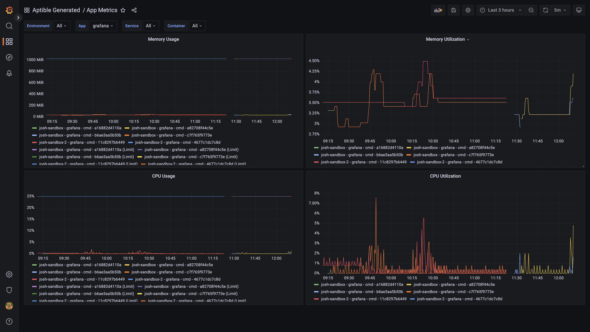
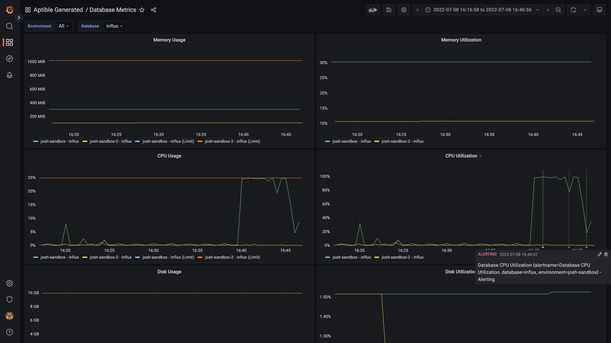

# Aptible Metrics Terraform Module

This terraform module is designed to make it simple to manage "self-hosted"
metrics collection and monitoring for Aptible Environments on Aptible. It
includes two submodules for managing resources:

## `aptible`

This module is responsible for managing the Aptible resources (and the Grafana
data source) necessary to collect and store container metrics.

### Dependencies

This module depends on the 
[Aptible CLI](https://deploy-docs.aptible.com/docs/cli) in order to set up the
PostgreSQL Database to manage Grafana sessions.

## `grafana`

This module is responsible for managing the Grafana resources necessary to
visualize and monitor metrics collected by Aptible Metric Drains.

<!-- BEGIN_TF_DOCS -->
## Requirements

No requirements.

## Providers

No providers.

## Modules

| Name | Source | Version |
|------|--------|---------|
|  [aptible](#module\_aptible) | ./modules/aptible | n/a |
|  [grafana](#module\_grafana) | ./modules/grafana | n/a |

## Resources

No resources.

## Inputs

| Name | Description | Type | Default | Required |
|------|-------------|------|---------|:--------:|
|  [metrics\_environment](#input\_metrics\_environment) | The handle of the environment to send metrics to. This can be one of the drain\_environments. | `string` | n/a | yes |
|  [alert\_threshold](#input\_alert\_threshold) | The threshold at which alerts are triggered for resource utilization. Default: 0.9 (90%). | `number` | `0.9` | no |
|  [alert\_trigger\_time](#input\_alert\_trigger\_time) | The time that it takes for an alert to be triggered with the threshold is crossed. Default: 5m. | `string` | `"5m"` | no |
|  [drain\_environments](#input\_drain\_environments) | The handles of the environments to drain metrics from. By default only the metrics\_environment will be drained. | `list(string)` | `null` | no |
|  [exclude\_alerts](#input\_exclude\_alerts) | If alert management should be excluded. | `bool` | `false` | no |
|  [folder\_title](#input\_folder\_title) | The title to use for the Grafana folder that will contain all of the managed resources. | `string` | `"Aptible Generated"` | no |
|  [grafana\_container\_count](#input\_grafana\_container\_count) | The number of Grafana App containers to deploy. | `number` | `null` | no |
|  [grafana\_container\_profile](#input\_grafana\_container\_profile) | The instance profile of the Grafana App containers. | `string` | `null` | no |
|  [grafana\_container\_size](#input\_grafana\_container\_size) | The size (in MB) of the Grafana App containers. | `number` | `null` | no |
|  [grafana\_db\_user](#input\_grafana\_db\_user) | The user that Grafana will use to access the PostgreSQL Database. This user is created and granted the necessary permissions on the Database. | `string` | `"grafana"` | no |
|  [grafana\_endpoint\_domain](#input\_grafana\_endpoint\_domain) | The custom domain for the Grafana Endpoint to use. By default the App's default domain will be used. Wildcard domains are not supported. | `string` | `null` | no |
|  [grafana\_handle](#input\_grafana\_handle) | The handle to use for the Grafana App. | `string` | `"grafana"` | no |
|  [grafana\_image\_tag](#input\_grafana\_image\_tag) | The grafana/grafana image tag (i.e. version) that the app will use. | `string` | `"latest"` | no |
|  [influx\_container\_profile](#input\_influx\_container\_profile) | The instance profile of the InfluxDB metrics Database container. | `string` | `null` | no |
|  [influx\_container\_size](#input\_influx\_container\_size) | The size (in MB) of the InfluxDB metrics Database container. | `number` | `null` | no |
|  [influx\_handle](#input\_influx\_handle) | The handle to use for the InfluxDB Database used to store metrics. | `string` | `"influx"` | no |
|  [postgres\_container\_profile](#input\_postgres\_container\_profile) | The instance profile of the PostgreSQL Grafana Database container. | `string` | `null` | no |
|  [postgres\_container\_size](#input\_postgres\_container\_size) | The size (in MB) of the PostgreSQL Grafana Database container. | `number` | `null` | no |
|  [postgres\_handle](#input\_postgres\_handle) | The handle to use for the PostgreSQL Database used for storing Grafana data. | `string` | `"pg-grafana"` | no |

## Outputs

| Name | Description |
|------|-------------|
|  [aptible](#output\_aptible) | All of the outputs from the aptible module. |
|  [grafana](#output\_grafana) | All of the outputs from the grafana module. |
<!-- END_TF_DOCS -->

## Dashboard Screenshots

### App Metrics

### Database Metrics

### Alerts

