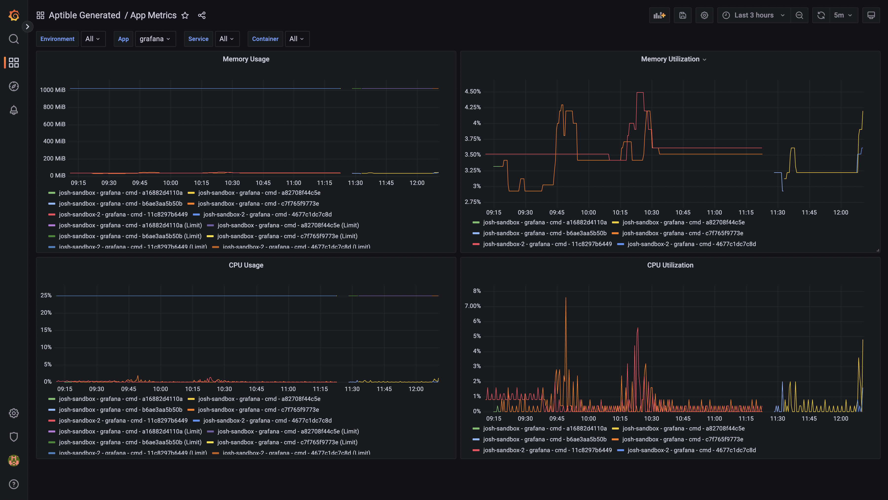
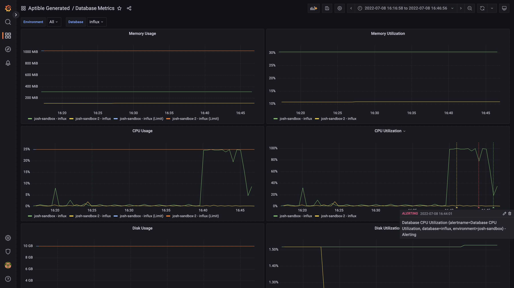
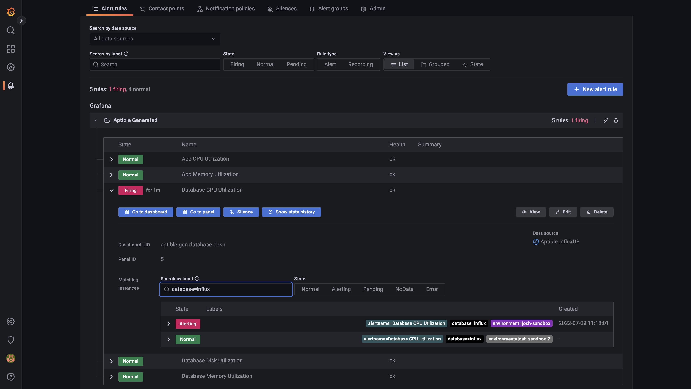

# Aptible Grafana Resources

This module is responsible for managing the Grafana resources necessary to
visualize and monitor metrics collected by Aptible Metric Drains. Use this
module to apply the Grafana dashboards and alert rules to an existing Grafana
instance. The module creates its own folder for the resources it manages so as
to not interfere with other resources.

<!-- BEGIN_TF_DOCS -->
## Requirements

| Name | Version |
|------|---------|
|  [grafana](#requirement\_grafana) | ~> 1.29.0 |

## Providers

| Name | Version |
|------|---------|
|  [grafana](#provider\_grafana) | ~> 1.29.0 |

## Modules

No modules.

## Resources

| Name | Type |
|------|------|
| [grafana_dashboard.app_metrics](https://registry.terraform.io/providers/grafana/grafana/latest/docs/resources/dashboard) | resource |
| [grafana_dashboard.database_metrics](https://registry.terraform.io/providers/grafana/grafana/latest/docs/resources/dashboard) | resource |
| [grafana_folder.aptible_generated](https://registry.terraform.io/providers/grafana/grafana/latest/docs/resources/folder) | resource |
| [grafana_rule_group.aptible_generated](https://registry.terraform.io/providers/grafana/grafana/latest/docs/resources/rule_group) | resource |

## Inputs

| Name | Description | Type | Default | Required |
|------|-------------|------|---------|:--------:|
|  [grafana\_auth](#input\_grafana\_auth) | Credentials to access Grafana in the form of user:password or an API key. | `string` | n/a | yes |
|  [grafana\_url](#input\_grafana\_url) | The base URL of the Grafana instance to configure. | `string` | n/a | yes |
|  [influx\_data\_source\_uid](#input\_influx\_data\_source\_uid) | The UID of the InfluxDB data source to use when creating Grafana resources. | `string` | n/a | yes |
|  [alert\_threshold](#input\_alert\_threshold) | The threshold at which alerts are triggered for resource utilization. Default: 0.9 (90%). | `number` | `0.9` | no |
|  [alert\_trigger\_time](#input\_alert\_trigger\_time) | The time that it takes for an alert to be triggered with the threshold is crossed. Default: 5m. | `string` | `"5m"` | no |
|  [exclude\_alerts](#input\_exclude\_alerts) | If alert management should be excluded. | `bool` | `false` | no |
|  [folder\_title](#input\_folder\_title) | The title to use for the Grafana folder that will contain all of the managed resources. | `string` | `"Aptible Generated"` | no |

## Outputs

| Name | Description |
|------|-------------|
|  [grafana\_folder](#output\_grafana\_folder) | The grafana\_folder that contains all of the module's resources. |
<!-- END_TF_DOCS -->

## Screenshots

### App Metrics

### Database Metrics

### Alerts

